# Analysis of Fused Deposition Modelling (FDM)

<div align="center">


**Modern Manufacturing Methods

*A comprehensive study of FDM process parameters, material behavior, and thermal simulations using COMSOL — with focus on PETG filament.*

</div>

---

##  Authors: Vaishanavi Sogalad 


---

## Table of Contents

- [Problem Statement](#-problem-statement)
- [What is FDM?](#-what-is-fdm)
- [Why This Matters](#-why-this-matters)
- [Project Overview](#-project-overview)
- [Materials Studied](#-materials-studied)
- [Process Parameters](#-process-parameters)
- [Simulation Setup](#-simulation-setup)
- [Results](#-results)
- [Applications](#-applications)
- [Challenges & Innovations](#-challenges--innovations)
- [Future Work](#-future-work)
- [Repository Structure](#-repository-structure)
- [How to Use This Project](#-how-to-use-this-project)
- [References](#-references)

---

## Problem Statement

Fused Deposition Modelling (FDM) is one of the most widely used 3D printing technologies, but **producing dimensionally accurate, mechanically strong, and thermally stable parts remains a challenge**. The outcome of an FDM print is highly sensitive to:

- Which **material (filament)** is used
- What **temperature** are the extruder and print bed set to
- How fast the print head **moves**
- The **layer thickness** and **raster angle** chosen
- How the part **cools** after deposition

Without understanding these parameters, printed parts can warp, crack, delaminate between layers, or fail mechanically. This becomes especially critical when FDM parts are used in aerospace, medical, or automotive applications where tolerances matter.

### Goals of This Project

1. **Understand** the FDM process from first principles — what happens to the material at every stage
2. **Compare** common FDM filament materials (PLA, ABS, PETG, Nylon, Composites) and identify which is best for different use cases
3. **Model and simulate** the thermal behavior of a PETG filament during deposition using COMSOL
4. **Identify** how heat transfers through and away from deposited material and what that means for bond strength and warping
5. **Explore** real-world applications and the limitations engineers face today

---

## What is FDM?

**Fused Deposition Modelling (FDM)** is an **additive manufacturing** process — meaning objects are *built up* layer by layer rather than carved out of a solid block.

### How It Works (Step by Step)

```
1. A spool of solid thermoplastic filament feeds into the print head
        ↓
2. The heater melts the filament (typically 180°C – 300°C depending on material)
        ↓
3. A motorized extruder pushes the molten plastic through a small nozzle
        ↓
4. The nozzle moves in X and Y directions, depositing a thin bead of plastic
        ↓
5. Each layer cools and solidifies, bonding to the layer below
        ↓
6. The build platform lowers (Z-axis), and the next layer begins
        ↓
7. This repeats until the full 3D object is complete
```

### Key Components of an FDM Printer

| Component | Function |
|-----------|----------|
| **Filament Spool** | Holds the raw thermoplastic material |
| **Extruder Motor** | Drives the filament into the hot end |
| **Heater Block** | Melts the filament to the target temperature |
| **Nozzle** | Shapes and deposits the molten bead |
| **Thermistor / Thermocouple** | Monitors and controls temperature |
| **Print Bed** | Surface where the object is built |
| **Stepper Motors + Pulleys** | Control precise movement in X, Y, Z |

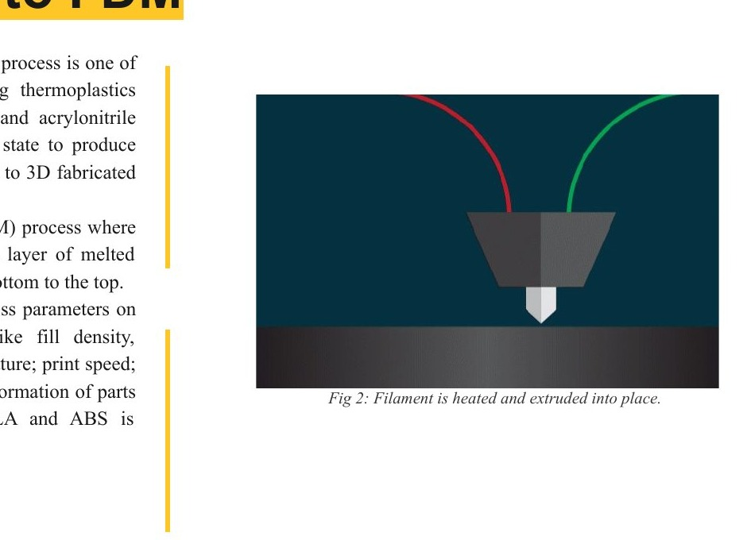
*Fig 2: Filament heated and extruded into place*

| | |
|---|---|
| 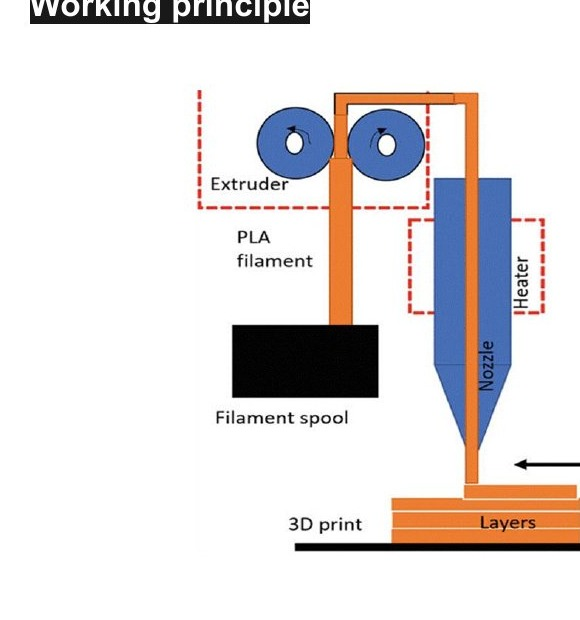 | 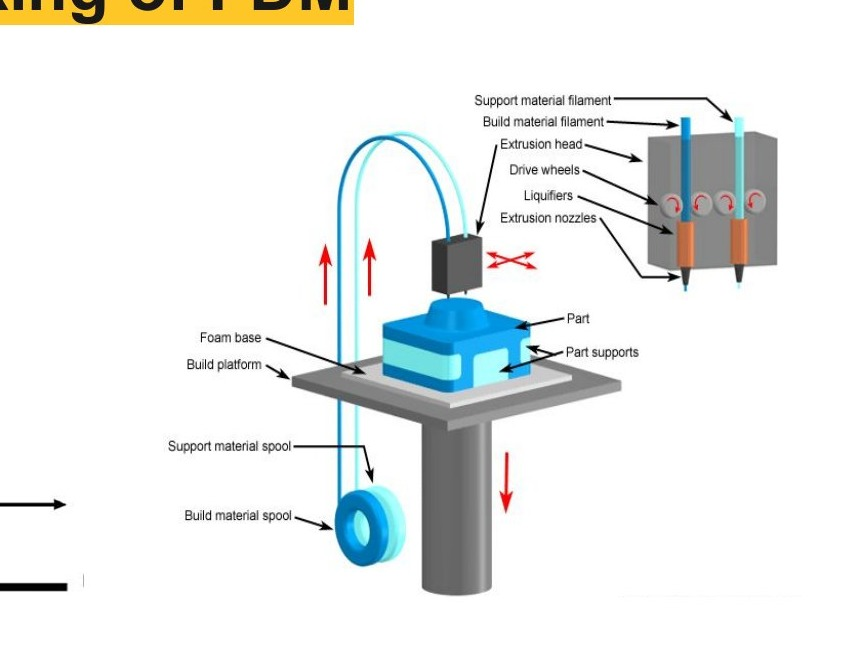 |
| *Fig 4a: FDM process schematic* | *Fig 4b: Full FDM system with build and support spools* |

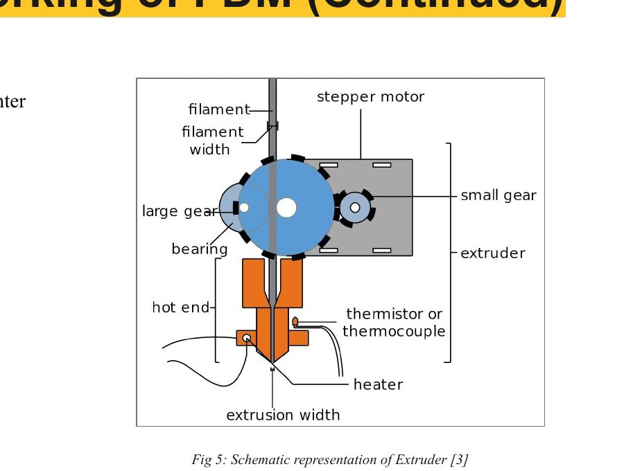
*Fig 5: Extruder schematic — stepper motor, drive gears, hot end, thermistor, and nozzle*

### Where FDM Fits in 3D Printing

```
3D Printing
├── Additive Processes
│   ├── Fused Deposition Modeling (FDM)  ← This project
│   └── Multi Jet Modeling
├── Lamination
└── Solidifying Processes
    ├── Selective Laser Sintering (SLS)
    ├── Selective Laser Melting (SLM)
    └── Stereolithography (SLA)
```

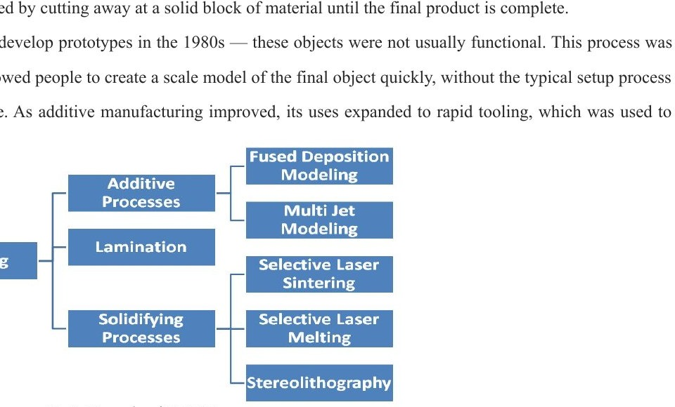
*Fig 1: Hierarchy of 3D Printing technologies*

---

## Why This Matters

FDM is the **most accessible and widely used** 3D printing technology in the world. It powers:

- Rapid prototyping in engineering labs
- Custom medical prosthetics and implants
- Lightweight structural parts in Formula 1 and aerospace
- Consumer electronics enclosures
- Educational tools

Understanding its thermal and mechanical behavior means engineers can **predict and prevent failures** before printing — saving time, material, and cost.

---

## Project Overview

This project analyzes FDM through three lenses:

### 1. Material Analysis
Characterizing five major filament types used in FDM — their properties, temperature requirements, strengths, and ideal use cases.

### 2. Process Parameter Study
Identifying the seven key machine parameters that control print quality:
- Build Orientation, Layer Thickness, Air Gap, Raster Angle, Print Speed, Flow Rate, Extrusion Temperature

### 3. Thermal Simulation (COMSOL Multiphysics)
Building a finite element model of PETG filament being deposited on a print bed and simulating:
- **Steady-state thermal** behavior (equilibrium temperature distribution)
- **Transient thermal** behavior (how temperature evolves over the first 20 seconds of deposition)

---

## Materials Studied

| Material | Key Properties | Extruder Temp | Best For |
|----------|---------------|---------------|----------|
| **ABS** | Tough, heat & impact resistant, needs heated bed | 215–230°C | Functional prototypes |
| **PLA** | Easy to print, biodegradable, but brittle | 180–220°C | Concept models, visual prototypes |
| **PETG**| Chemical & humidity resistant, high transparency, minimal warping | 220–250°C | Waterproof parts, snap-fit components |
| **Nylon** | Strong, lightweight, partially flexible | 250°C | Wear-resistant parts, functional prototypes |
| **Composites** (Carbon Fiber, Kevlar, Fiberglass) | Extremely rigid and strong | 200–300°C | Jigs, fixtures, high-performance tooling |

> **PETG was selected as the focus material** for simulation due to its balance of printability, mechanical performance, and real-world relevance.

| | |
|---|---|
| 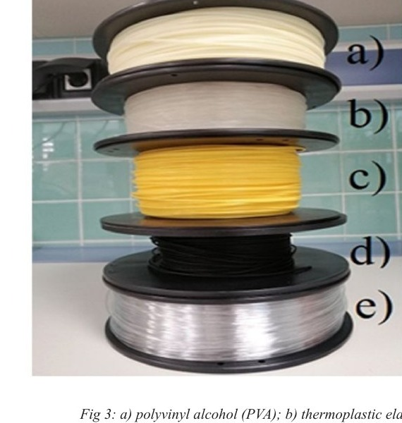 | 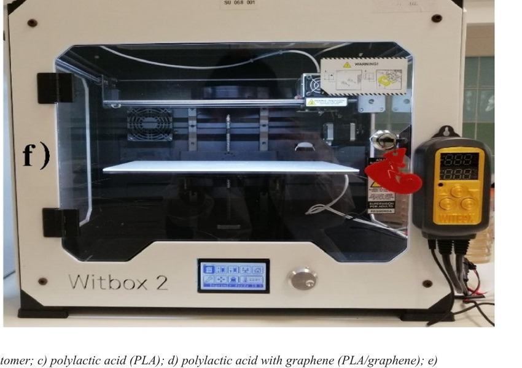 |
| *Fig 3: Filament spools — PVA, TPE, PLA, PLA/graphene, Polycarbonate* | *Fig 3f: BQ Witbox 2 FDM printer with heated bed* |

### Why PETG?

- Minimal shrinkage and warping during cooling → better dimensional accuracy
- Strong interlayer bonding and glossy surface finish
- FDA-approved grades available for food contact
- No toxic fumes at standard printing temperatures
- Widely used across medical, industrial, and consumer applications

---

## Process Parameters

Seven machine parameters were studied for their impact on part quality:

```
┌─────────────────────────────────────────────────────────────┐
│                    FDM PROCESS PARAMETERS                   │
├──────────────────────┬──────────────────────────────────────┤
│ Build Orientation    │ Angle at which part is printed       │
│ Layer Thickness      │ Height of each deposited bead        │
│ Air Gap              │ Space between adjacent raster lines  │
│ Raster Angle         │ Direction filament is deposited      │
│ Print Speed          │ How fast the nozzle travels          │
│ Flow Rate            │ Volume of material extruded/sec      │
│ Extrusion Temperature│ Melt temperature at the nozzle       │
└──────────────────────┴──────────────────────────────────────┘
```

These parameters interact with each other. For example:
- Higher print speed → less time for proper layer bonding → weaker parts
- Thicker layers → faster prints → but rougher surface finish
- Wrong extrusion temperature → either under-extrusion (gaps) or stringing/oozing

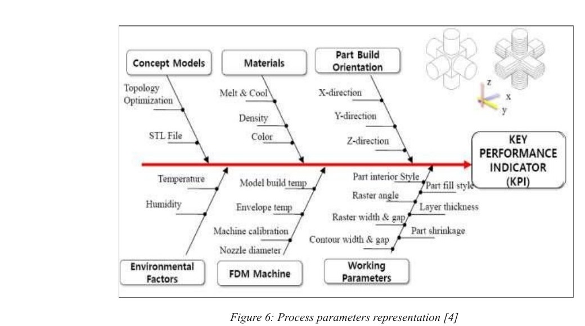
*Fig 6: FDM process parameters — environmental factors, machine settings, materials, and working parameters all feeding into Key Performance Indicators (KPI)*

---

## Simulation Setup

### Analytical Model — Yardimci Heat Transfer Equation

The thermal behavior of a deposited filament is governed by:

```
ρ (∂q/∂t) = k (∂²T/∂x²) − (h/h_eff)(T − T∞) − (k/Width²)(T − T_neigh)
```

Where each term represents:
- **ρ (∂q/∂t)** → Heat stored in the filament during deposition
- **k (∂²T/∂x²)** → Heat conduction along the filament (x-direction)
- **(h/h_eff)(T − T∞)** → Convective heat loss to surrounding air
- **(k/Width²)(T − T_neigh)** → Heat transfer to neighboring filaments or layers

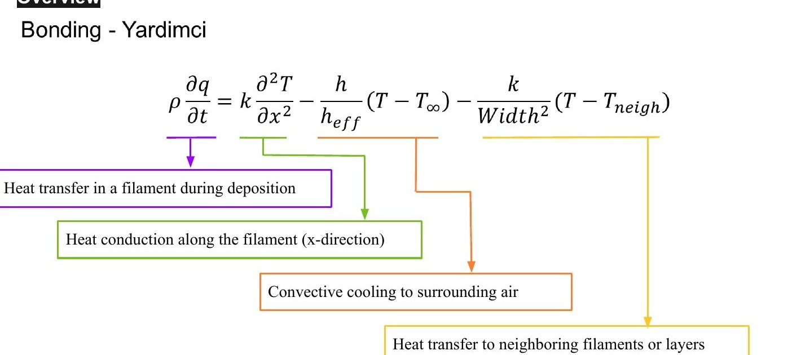
*Fig 9: Yardimci bonding model — each term of the governing heat equation mapped to its physical meaning*

### COMSOL Model Geometry

| Component | Dimensions |
|-----------|-----------|
| Print Bed | 50mm × 50mm × 30mm |
| PETG Filament | 15mm × 10mm × 2mm (rectangular bead) |

### PETG Material Properties Used

| Property | Value |
|----------|-------|
| Density | 1270 kg/m³ |
| Thermal Conductivity | 0.17 W/mK |
| Specific Heat | 1200 J/kg·K |
| Extruder Temperature | 220°C – 250°C |

### Mesh Settings
- **Mesh Resolution:** 3
- **Minimum Edge Length:** 2.5 × 10⁻³ m

| | |
|---|---|
| 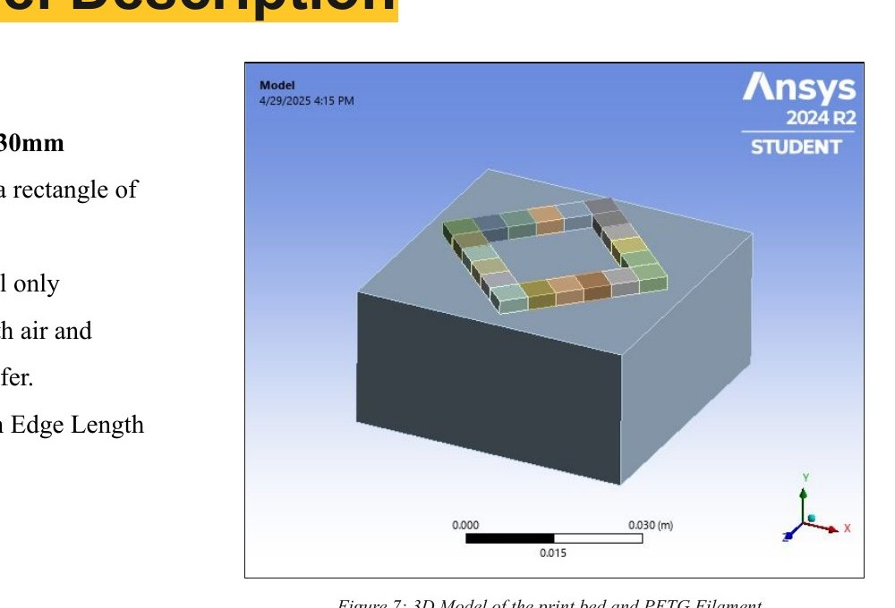 | 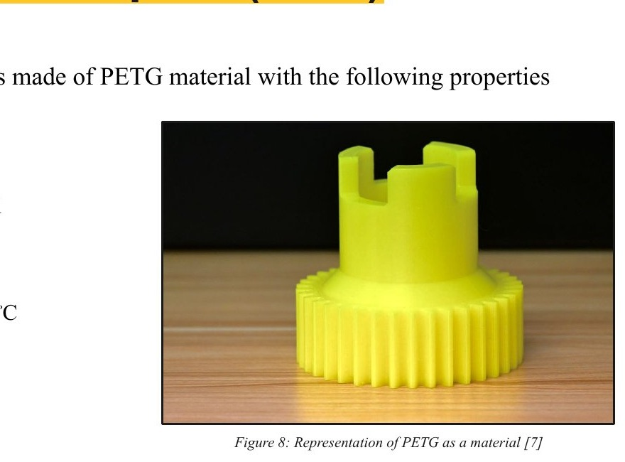 |
| *Fig 7: COMSOL 3D model — print bed (50×50×30mm) with PETG filament bead on top* | *Fig 8: PETG printed part showing surface finish and layer structure* |

---

## Results

### Steady-State Thermal Simulation

At thermal equilibrium (time → ∞), the model shows temperature distribution across the print bed and filament:

| Region | Temperature |
|--------|-------------|
| Maximum (filament surface) | **80°C** |
| Minimum (bed base) | **22°C** |

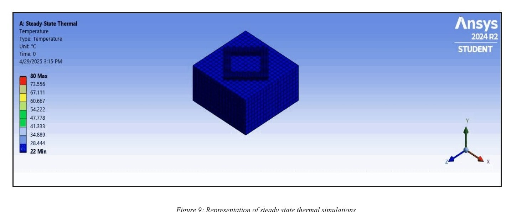
*Fig 9: COMSOL steady-state thermal result — temperature contour from 22°C (blue, bed base) to 80°C (red, filament surface)*

The temperature gradient confirms that the filament retains significant heat at its surface while the print bed acts as a heat sink through conduction.

### Transient Thermal Simulation (0 – 20 seconds)

The time-dependent simulation captures how the newly deposited PETG filament heats and cools during the printing process:

| Metric | Value |
|--------|-------|
| Maximum Temperature | **90.67°C** |
| Average Temperature | **30.2°C** |
| Minimum Temperature | **−9.4°C** |

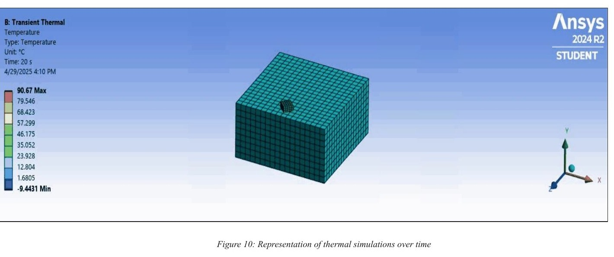
*Fig 10: COMSOL transient thermal result at t = 20s — temperature distribution across the full assembly*

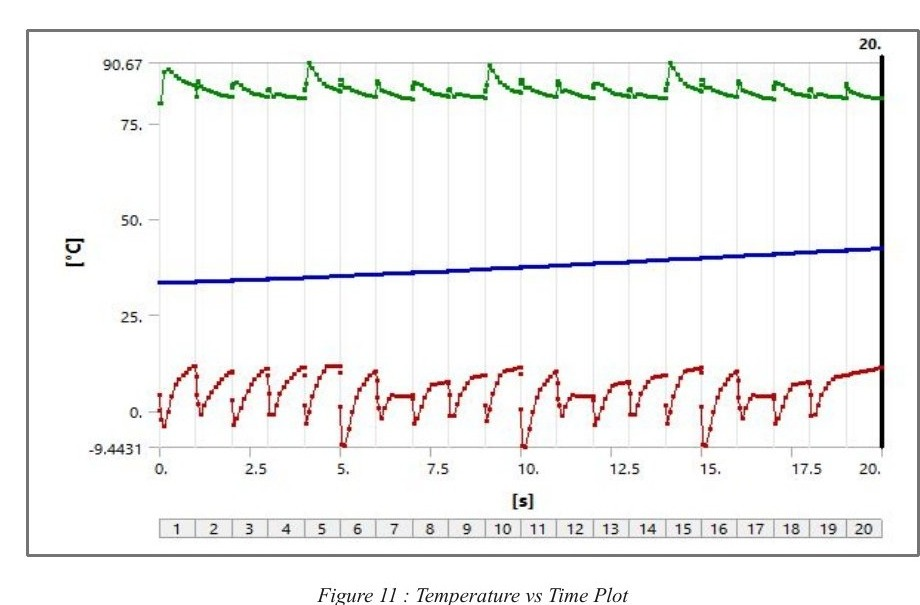
*Fig 11: Temperature vs Time (0–20s) — Green: maximum, Blue: average, Red: minimum. Oscillations correspond to cyclic bead deposition*

**Key observations from the Temperature vs. Time plot:**
- The **maximum temperature** (green curve) oscillates — spiking each time a new hot bead is deposited, then partially cooling between passes
- The **average temperature** (blue curve) rises gradually over time — meaning the overall print body accumulates heat as more layers are added
- The **minimum temperature** (red curve) oscillates near ambient — representing the outer surfaces of the print bed that are cooled by convection

> The oscillatory pattern in temperature directly corresponds to the cyclic deposition of new filament beads. Each new bead reheats nearby material, briefly reactivating the bonding zone — this is what creates interlayer adhesion.

---

## Applications

### FDM in Industry

| Sector | Application |
|--------|-------------|
| **Motorsports** | NACA ducts for engine cooling (NASCAR), hydraulic pipe supports (Formula 1) |
| **Aerospace** | Drone propellers, base plates, engine compartment components, cabin accessories |
| **Film & Entertainment** | Props, helmets, masks — complex shapes at low cost |
| **Medical** | Personalized prosthetics, micro-scale implants |

| | | |
|---|---|---|
| 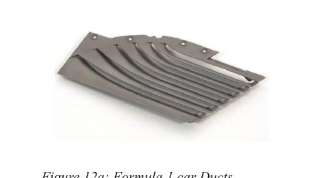 | 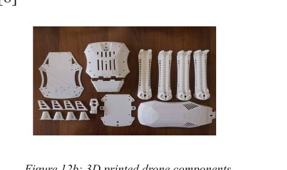 | 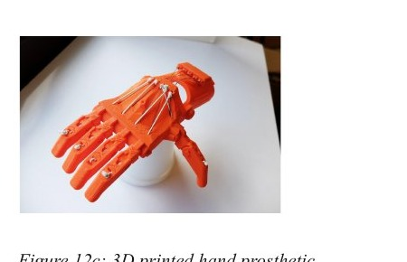 |
| *Fig 12a: Formula 1 car NACA ducts* | *Fig 12b: 3D printed drone components* | *Fig 12c: 3D printed hand prosthetic* |

### PETG-Specific Applications

| Sector | Application |
|--------|-------------|
| **Packaging** | Water bottles, food containers (FDA approved) |
| **Automotive** | Interior components, seat covers, sound insulation panels |
| **Electronics** | Capacitor films, PCB insulation |
| **Medical** | Surgical sutures, pharmaceutical packaging (high-temp sterilization rated) |

| | |
|---|---|
| 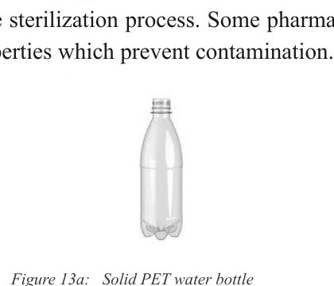 | 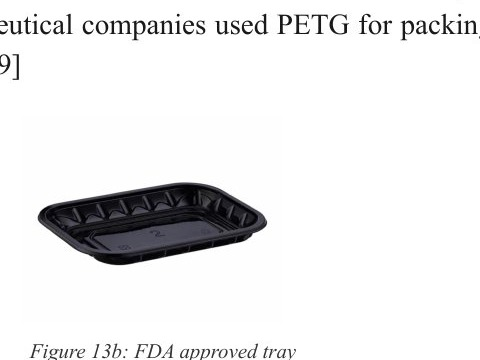 |
| *Fig 13a: Solid PET water bottle* | *Fig 13b: FDA-approved PETG food tray* |

---

## Challenges & Innovations

### Challenges with PETG

| Challenge | Description |
|-----------|-------------|
| **Hygroscopic** | Absorbs moisture from air → causes bubbling and nozzle clogging; must be dried before printing |
| **Stringing** | Semi-crystalline nature causes thin strings between travel moves; requires careful retraction tuning |
| **Temperature Requirements** | 230–260°C nozzle temperature — too high for basic entry-level printers |

### Innovations

- **Minimal warping** — PETG has very low thermal shrinkage compared to ABS, making it easier to print large parts without a heated enclosure
- **Superior interlayer bonding** — Glossy finish and strong layer fusion reduce the need for post-processing
- **FDA-compliant grades** — Opens the door to food-safe and medical applications unavailable to most FDM materials

---

## Future Work

Three promising directions for advancing PETG-based FDM:

1. **Composite Reinforcement**
   Reinforcing PETG with carbon fiber, glass fiber, or nano-additives to improve mechanical strength, heat resistance, and dimensional stability — making it viable for structural engineering applications.

2. **Biomedical & Food-Grade Expansion**
   Leveraging PETG's biocompatibility and FDA-approved variants for custom orthotics, surgical guides, and food-grade packaging, particularly as FDM printing standards become more regulated.

3. **Hybrid & Multi-Material Printing**
   Advances in dual-extrusion printers may allow PETG to be combined with flexible or conductive filaments, enabling functional prototypes, wearable electronics, and sensor-integrated components.

| | | |
|---|---|---|
| 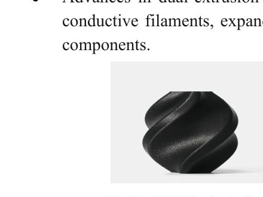 | 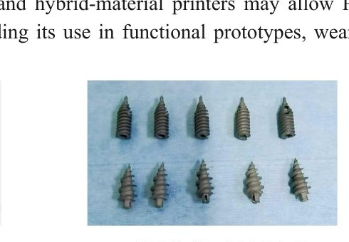 | 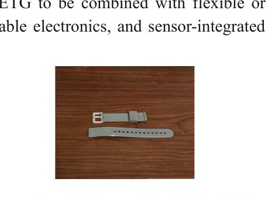 |
| *Fig 14a: Carbon fiber reinforced PET object* | *Fig 14b: 3D printed orthotic screws* | *Fig 14c: Watch strap from hybrid material* |

---

## Repository Structure

```
fdm-analysis/
│
├── README.md                        ← You are here — full project overview
│
├── simulation/
│   ├── steady_state_thermal.md      ← Steady-state COMSOL setup & results
│   ├── transient_thermal.md         ← Transient COMSOL setup & results
│   └── analytical_model.md         ← Yardimci heat transfer derivation
│
├── materials/
│   └── material_comparison.md      ← Full comparison of PLA, ABS, PETG, Nylon, Composites
│
├── docs/
│   ├── process_parameters.md       ← Detailed guide to all 7 FDM parameters
│   └── fdm_working_principle.md    ← How the printer works, component by component
│
├── figures/
│   └── (simulation screenshots, diagrams)
│
└── LICENSE                          ← MIT License
```

---

## How to Use This Project

### If you're a student learning about FDM:
1. Start with **[What is FDM?](#-what-is-fdm)** and **[Materials Studied](#-materials-studied)**
2. Read `docs/fdm_working_principle.md` for a deep dive into the hardware
3. Review `docs/process_parameters.md` to understand what to tune when printing

### If you're running the simulation yourself:
1. Open **COMSOL Multiphysics**
2. Create a new model → select **Heat Transfer in Solids** physics
3. Use the geometry and material properties in `simulation/steady_state_thermal.md`
4. Apply the boundary conditions described in `simulation/transient_thermal.md`
5. Set mesh to **Fine** or equivalent element size of 2.5e-3 m
6. Run **Stationary** study first (steady-state), then **Time Dependent** study (0–20s)
7. Compare your Temperature vs. Time plot against the results in this repo

### If you're referencing this for your own project:
- All material property data is sourced and cited (see [References](#-references))
- The Yardimci analytical model derivation is in `simulation/analytical_model.md`
- Feel free to adapt the COMSOL setup for different materials — just swap the thermal conductivity, density, and specific heat values

---

## References

1. Mwema, F. & Akinlabi, E. (2020). *Basics of Fused Deposition Modelling (FDM)*. DOI: 10.1007/978-3-030-48259-6_1

2. Carausu, C. et al. (2018). *The 3D printing modelling of biodegradable material*. IOP Conference Series: Materials Science and Engineering, 400, 042008.

3. Engineers Garage. *3D printing processes – Material extrusion (Part 2/8)*. Available at: https://www.engineersgarage.com

4. Narang, R. & Chhabra, D. (2017). *Analysis of Process Parameters of Fused Deposition Modeling (FDM) Technique*.

5. Apaçoğlu-Turan, B., Kırkköprü, K., & Çakan, M. (2024). *Numerical Modeling and Analysis of Transient and Three-Dimensional Heat Transfer in 3D Printing via FDM*. Computation, 12(2), 27.

6. Robles Poblete, F. et al. (2023). *In Situ, Real-Time Temperature Mapping and Thermal FE Simulations of Large-Format 3D Printed PET/CF Vertical Wall*. Materials, 16(19), 6486.

7. PrintPool. *PET-G 3D printing material*. Available at: https://www.printpool.co.uk/materials/pet-g

8. Cano-Vicent, A. et al. *Fused deposition modelling: Current status, methodology, applications and future prospects*. DOI: 10.1016/j.addma.2021.102378

9. Yan, C., Kleiner, C., Tabigue, A., & Shah, V. *PETG: Applications in Modern Medicine*. ISSN 2666-1381.

---

## License

This project is licensed under the **MIT License** — see the [LICENSE](LICENSE) file for details.

You are free to use, adapt, and reference this work for educational and research purposes with attribution.

---

<div align="center">

**Arizona State University · Modern Manufacturing · 2024**

*Copyright © 2024 Arizona Board of Regents*

</div>
